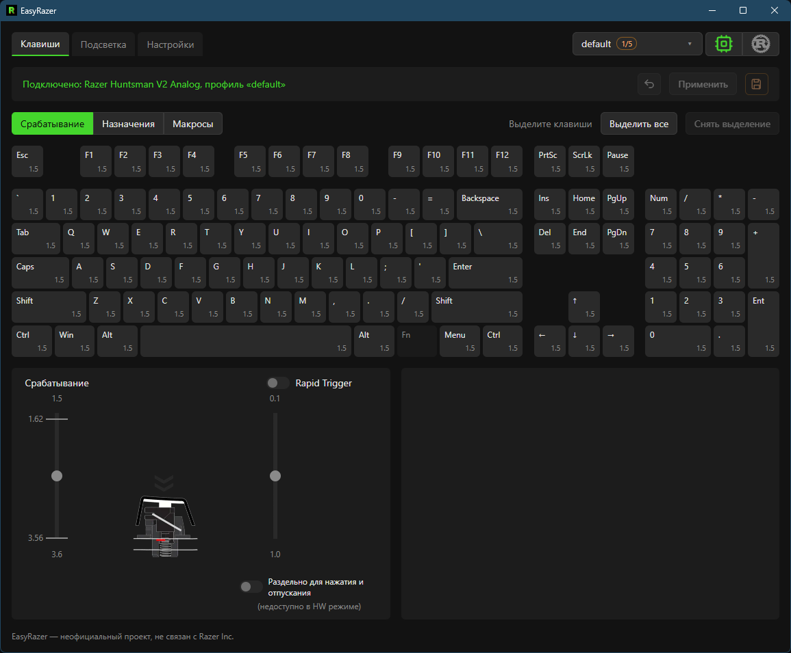

# EasyRazer

[Русская версия](docs/README.ru.md)

A lightweight Razer Synapse replacement for the Razer Huntsman V2 Analog (`1532:0266`)
on Windows. The actuation point of every key (1.5–3.6 mm) is written to the keyboard's
memory, after which it works with no software running at all.

**Unofficial project, not affiliated with Razer Inc.**



## Features

- shows and changes the actuation point of every key: "Apply" lasts until reconnect,
  "Write" stores it in the keyboard (a backup goes to `%APPDATA%\EasyRazer` before the
  first write of a session);
- profiles: any number in the app, up to five in the keyboard; Fn+Menu cycles them;
- key remapping: another key with modifiers, mouse buttons, media, disable;
- per-key Rapid Trigger with separate press and release sensitivity
  (computed by the app while it runs);
- macros: keys, mouse, delays, recording;
- built-in lighting effects with live preview and a custom per-key and per-zone colour layout;
- Windows Dynamic Lighting toggle;
- lives in the tray: starts with Windows, restores settings after reconnect, sleep
  and Synapse exit;
- English and Russian UI.

Details and caveats: [user guide](docs/usage.md) (in Russian).

## Compared to Synapse

Measured on the same PC: Synapse 4.0.827 right after launch, EasyRazer 0.2.2 in the
tray in HW mode.

| | Synapse 4 | EasyRazer |
|---|---|---|
| Stack | Electron (`RazerAppEngine`) plus Windows services | Rust core, Tauri 2, Vue UI on the system WebView2 |
| Install | installer, ~1.2 GB on disk | one 8 MB `.exe`, no installer |
| Processes | 13: 11 × `RazerAppEngine`, Elevation Service, Game Manager Service | 7: `easyrazer` and 6 × WebView2 |
| RAM, working set / private | ~1.75 GB / ~1.07 GB | ~385 MB / ~235 MB, of which `easyrazer` itself is 29 MB / 8 MB and the rest is WebView2 |
| Network | loads device modules from `apps.razer.com` | none, works offline |
| Who detects key presses | the host, always: Synapse sets every key to `0/0` and runs the keyboard in driver mode | the keyboard firmware by default (HW mode); the host only in driver mode, when you want Rapid Trigger |

### HW mode

In HW mode the keyboard types on its own, exactly as with no software installed:
no host in the input path, no extra latency, nothing to crash. EasyRazer switches to
driver mode only when you need Rapid Trigger — the Huntsman V2 Analog has no hardware
RT, so Synapse computes it on the host too. EasyRazer puts the keyboard back into HW
mode when it exits, fails, or sees Synapse start.

The trade-off: in HW mode the firmware clamps actuation to 1.62–3.56 mm; the full
1.5–3.6 mm range needs driver mode.

### Flash wear

The keyboard's MCU (STM32L4+) is rated for 10,000 erases per 4 KB flash page. The
firmware has no wear levelling and no erase counter, and any write, even 4 bytes,
erases a whole page. So EasyRazer:

- applies changes to the keyboard's RAM; flash is written only by an explicit
  "Write" or the floppy icon, with an optional confirmation;
- writes a profile slot as one batch, and only the keys that differ from what is
  already stored;
- keeps Rapid Trigger and the custom colour layout in the app, never in flash.

Firmware analysis: [firmware.md](docs/firmware.md) (in Russian).

### What Synapse still has

Snap Tap, the Hypershift layer, game mode and gamepad emulation — see the roadmap.

## Synapse

Synapse keeps the keyboard in its own mode and overwrites settings. Quit it
completely, including the tray icon, before using EasyRazer. While it runs,
EasyRazer writes nothing.

## Building

Requires Rust (MSVC), Bun and MSVC Build Tools.

```
cd app
bun install
bun tauri dev      # run with rebuild on changes
bun tauri build    # ..\target\release\easyrazer.exe
```

The resulting `easyrazer.exe` is a single file with no installer; copy it anywhere.

Tests (from the repository root): `cargo test`; frontend: `bun run lint` (in `app`).
Test on a real keyboard (Synapse closed): `cargo test -p easyrazer -- --ignored`.

## Documentation (in Russian)

- [User guide](docs/usage.md) — features, controls, limitations.
- [Development](docs/development.md) — layout, rules, adding a keyboard model.
- [Protocol](docs/protocol.md) — Razer commands and everything verified on hardware.

## Roadmap

- [x] Protocol: actuation read and write, modes, depth stream, lighting
- [x] Per-key actuation: temporary and in keyboard memory
- [x] Built-in lighting effects, Windows Dynamic Lighting
- [x] Tray, autostart, restore after reconnect and sleep
- [x] Custom colour layout
- [x] English and Russian UI
- [x] Rapid Trigger and the HW / Driver switch
- [ ] Snap Tap
- [x] Volume wheel and Fn+F9/F10/Menu
- [x] Profiles: in the app and in keyboard memory
- [ ] Host-driven lighting animations
- [x] Key remapping
- [ ] Hypershift layer
- [x] Macros: keys, mouse, delays, recording
- [ ] Game mode, gamepad
- [ ] Other keyboard models
- [ ] Linux
